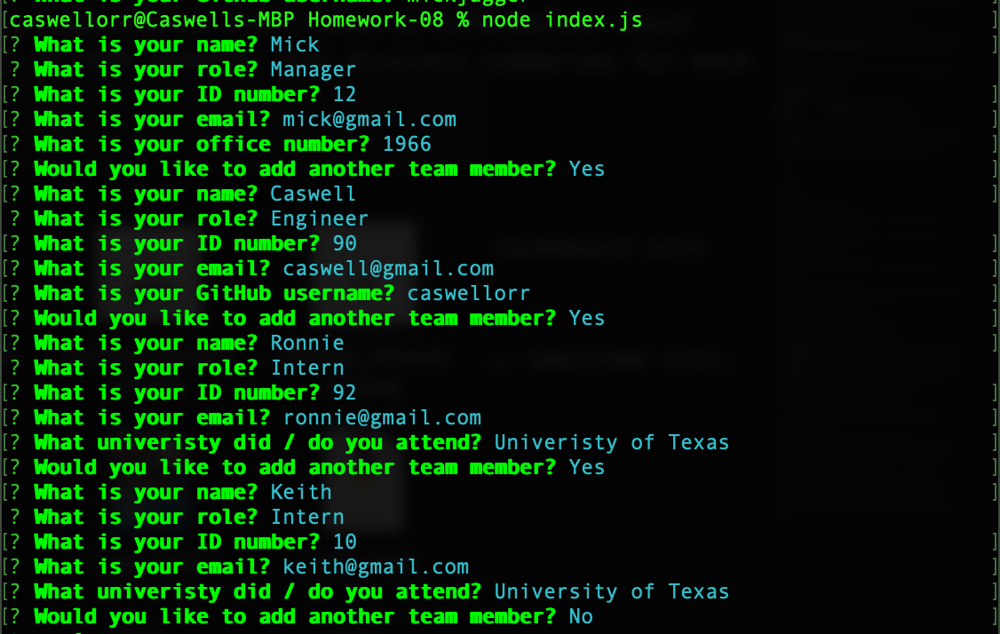
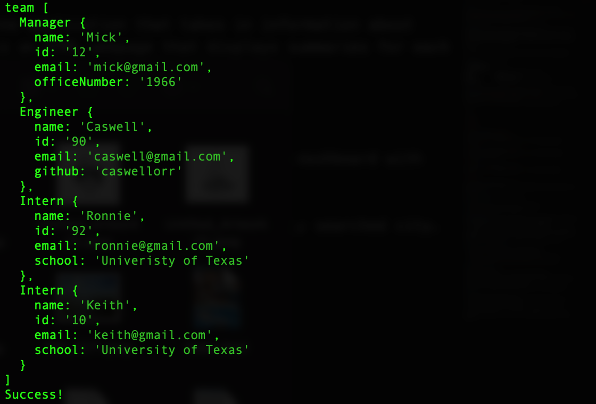
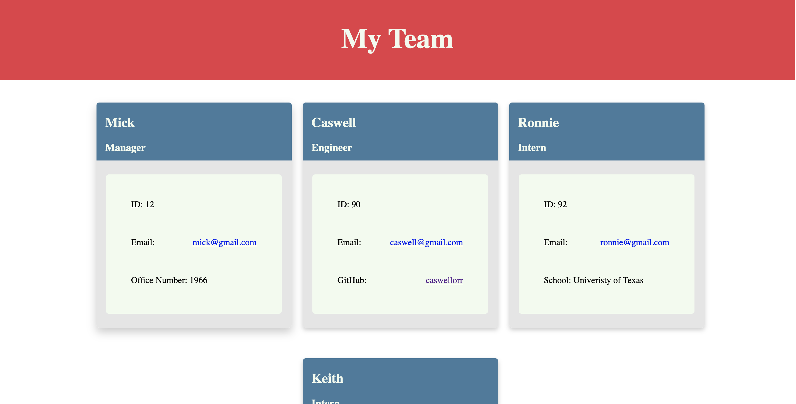

# 🏗️ Team Profile Generator

Link : 

## Description 📖

The Team Profile Generator Your is a Node.js command-line application that takes in information about employees on a software engineering team, then generates an HTML webpage that displays summaries for each person, including their name, role, employee ID number, and email.

## Features 📝

The app uses inquirer to prompt the user in the terminal to input information.

Object-oriented programming takes the user inputed information from the command line and generates objects in JS indexes. 

Then that information is written to an html index using the file system module.

Testing is key to making code maintainable, so also featuerd are a unit tests for every part of my code.

## Screenshots 📷 :

* User inputs information:

  
  
* User presented with a Success message if the code passes:

  

* User inputs displayed on an html page:

  
  

## Takeaways 💡

I learned a ton abou tthe power of object-oriented programming and require. 

I also learned about asynchronous / await functions. 

I also leanred how to utilize array methods, including push, map and join. 
 

----
© 2021 Caswell Orr. Confidential and Proprietary. All Rights Reserved.
